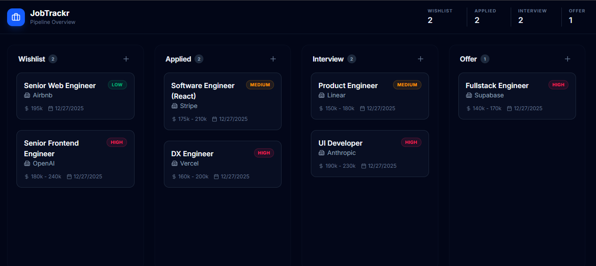
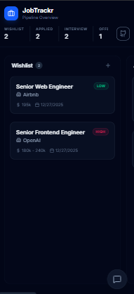
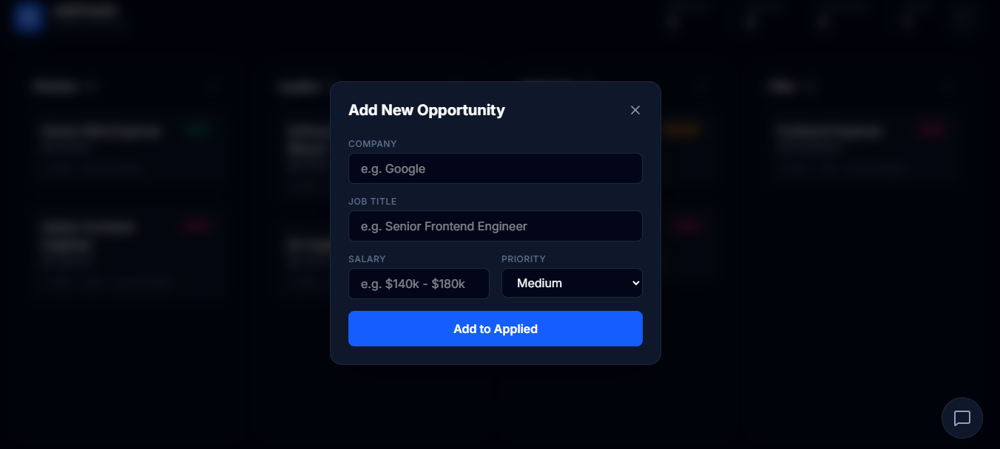

# 📂 JobTrackr

**The Modern Kanban Pipeline for the Elite Job Hunt.**

JobTrackr is a production-ready, local-first Kanban board designed to streamline the career search. Built with a "Dark Luxury" aesthetic, it focuses on high-performance interactions, seamless drag-and-drop, and zero-latency data management.

[](https://job-trackr-chi.vercel.app/)


---

## Preview

| Desktop View | Mobile View |
|-------------|-------------|
|  |  |

| Add Job Modal |
|--------------|
|  |

*A "Dark Luxury" aesthetic featuring responsive columns and priority badges.*


---

## ✨ Key Features

- **Kanban Workflow:** Manage applications through stages: *Wishlist, Applied, Interview, and Offer*.
- **Drag & Drop:** Smooth reordering powered by `@hello-pangea/dnd`.
- **Local-First:** Data persists in `localStorage` via Zustand; no database required, 100% private.
- **Responsive Layout:** Mobile-first horizontal-swipe interface for on-the-go tracking.
- **Automated Testing:** Robust E2E testing suite using **Playwright** to ensure reliable CRUD and persistence flows.
- **Design System:** Zinc/Slate palette with glassmorphism and Lucide icons.

---

## Technical Architecture (The Cycle)

This project is built using a strict **Unidirectional Data Flow** pattern, making the codebase highly predictable and maintainable:

- **State Management:** **Zustand** acts as the central "Brain."
- **Input/Event:** User actions (typing or dragging) trigger specific React events.
- **Domain Logic:** Data is processed (e.g., `uuidv4()` generation) before hitting the store.
- **CRUD:** Operations update the store, which automatically syncs to LocalStorage.
- **UI Output:** React re-renders only the necessary components for a zero-lag experience.
- **Persistence:** Real-time synchronization between the state and browser `localStorage`.
- **E2E Testing:** Playwright simulates real user behavior to verify the entire cycle from input to UI output.

---

## Tech Stack

- **Framework:** Next.js 14 (App Router)
- **Language:** TypeScript
- **State:** Zustand + Persist Middleware
- **Testing:** Playwright (End-to-End)
- **Drag & Drop:** @hello-pangea/dnd
- **Styling:** Tailwind CSS

---

## 📦 Getting Started

### 1. Installation
```bash
git clone https://github.com/git-ellea/jobtrackr.git
cd jobtrackr
npm install
```

### 2. Development
```bash
npm run dev
```

### 3. Running Tests
To run the Playwright test suite:
```bash
npx playwright test
```
To view the tests in the interactive UI:
```bash
npx playwright test --ui
```


---

## 🤝 Contributing & Support

If you find this project useful for your job search or as a coding template:
- 🌟 **Star the project** to show support.
- 🍴 **Fork it** to customize your own tracker.
- 💬 **Open an issue** for feature requests!

Developed by [Ella](https://github.com/git-ellea)
